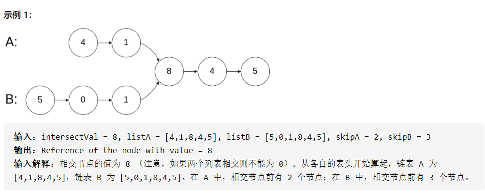
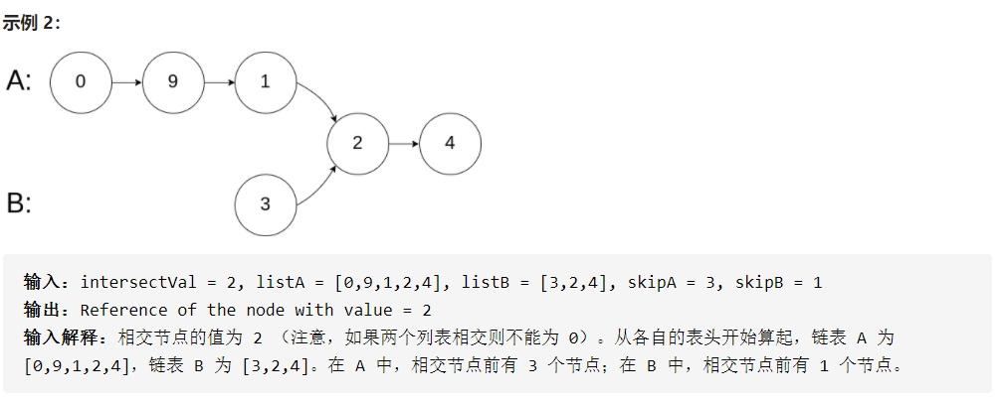
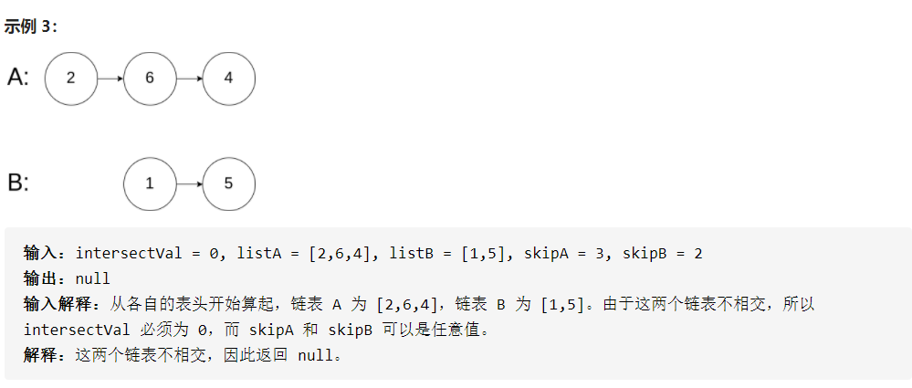
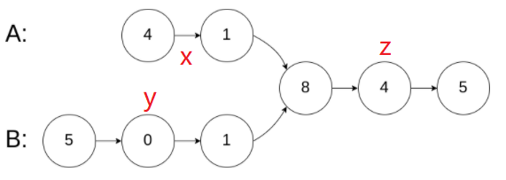

## 题目

```None
输入两个链表，找出它们的第一个公共节点。
```







## 思路

（可选）

## 补充

- Python列表表达式不能用来赋值

  ```python
  [a=1 for i in range(3)] # 错误
  [a+1 for i in range(3)] # [4, 4, 4]
  ```

## 题解

方法1：集合法，用集合来判断是否是公共元素

```python
# Definition for singly-linked list.
# class ListNode:
#     def __init__(self, x):
#         self.val = x
#         self.next = None

class Solution:
    def getIntersectionNode(self, headA: ListNode, headB: ListNode) -> ListNode:
        nodeSet = set()
        while headA: # 将A链所有元素放到set中
            nodeSet.add(headA)
            headA = headA.next
        while headB: # 将B链元素放到set中，如果长度不增加则为公共节点
            temp = len(nodeSet)
            nodeSet.add(headB)
            if len(nodeSet) == temp:
                return headB
            else:
                headB = headB.next
        return None
```

方法2：统计两个链表长度得到长度差x，长的链表先移动x个节点

```python
class Solution:
    def getIntersectionNode(self, headA: ListNode, headB: ListNode) -> ListNode:
        lA, lB = 0, 0  # 值类型可以使用lA = lB = 0
        nodeA, nodeB = headA, headB
        while nodeA:
            lA, nodeA = lA + 1, nodeA.next
        while nodeB:
            lB, nodeB = lB + 1, nodeB.next

        nodeA, nodeB = headA, headB
        if lA > lB:
            for i in range(lA - lB):
                nodeA = nodeA.next
        if lA < lB:
            for i in range(lB - lA):
                nodeB = nodeB.next

        while nodeA and nodeB:
            if nodeA == nodeB:
                return nodeA
            nodeA, nodeB = nodeA.next, nodeB.next
```

方法3：双指针法，A移动x+z+y次，B移动y+z+x次，如果无公共节点则node=nodeB=None



```python
class Solution:
    def getIntersectionNode(self, headA: ListNode, headB: ListNode) -> ListNode:
        # 保留两个链表头结点，否则指针到一链表末尾时无法跳转到另一链表
        nodeA = headA 
        nodeB = headB
        while nodeA != nodeB:
            nodeA =  nodeA.next if nodeA else headB
            nodeB =  nodeB.next if nodeB else headA
        return nodeA
```

