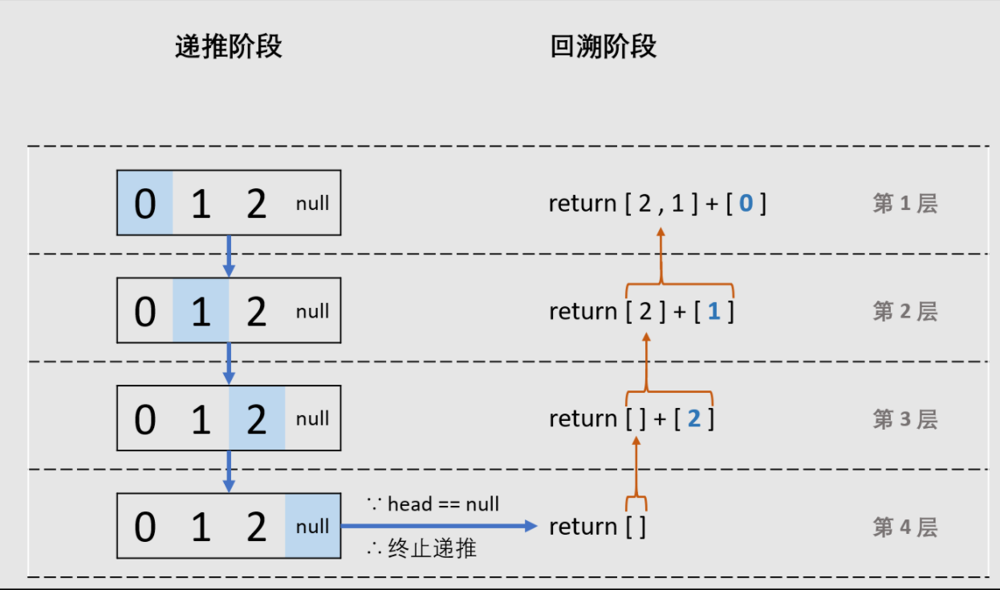

## 题目

```None
输入一个链表的头节点，从尾到头反过来返回每个节点的值（用数组返回）
```

示例 1：

```
输入：head = [1,3,2]
输出：[2,3,1]
```

## 思路

（可选）

## 补充

（可选）

## 题解

方法1：辅助栈

```python
class Solution:
    def reversePrint(self, head: ListNode) -> List[int]:
        nodes = []
        while head:
            nodes.append(head.val)
            head = head.next
        return list(reversed(nodes)) # nodes[::-1]
```

复杂度分析

```
时间复杂度O(n)：正向遍历链表 + 反向遍历列表
空间复杂度O(n)：辅助栈存储每个节点值
```

方法2：递归法（大神解法）



```python
class Solution:
    def reversePrint(self, head: ListNode) -> List[int]:
        return self.reversePrint(head.next) + [head.val] if head else []
```

方法3：反转链表（略）