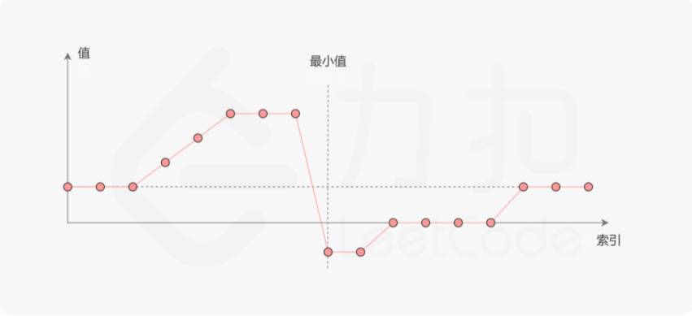

## 题目

```None
把一个数组最开始的若干个元素搬到数组的末尾，我们称之为数组的旋转。
输入一个递增排序的数组的一个旋转，输出旋转数组的最小元素。
例如，数组 [3,4,5,1,2] 为 [1,2,3,4,5] 的一个旋转，该数组的最小值为1。  
----------------------------------------------------------------
输入：[3,4,5,1,2]
输出：1
----------------------------------------------------------------
输入：[2,2,2,0,1]
输出：0
```



## 思路

- 特殊的二分查找


## 补充

（可选）

## 题解

方法1：

```python

```