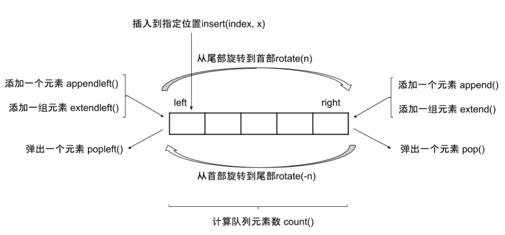

## 题目

```None
从上到下打印出二叉树的每个节点，同一层的节点按照从左到右的顺序打印。
-------------------------------------------------------------
例如:
给定二叉树: [3,9,20,null,null,15,7],
    3
   / \
  9  20
    /  \
   15   7
返回：
[3,9,20,15,7]
-------------------------------------------------------------
提示：节点总数 <= 1000
```

## 思路

- BFS遍历


## 补充

```
python中list和collections.deque的区别：
------------------------------------------
	列表list的pop(0)方法时间复杂度为O(N)
	list是数组，移除头部元素的方式是把后面的元素全部往前移动一位，所以是O(N)
	-------------------------------------------------------------
	collections中的双端队列deque()，其popleft()方法可达到O(1)复杂度
	deque底层是链表，头部和尾部是等价的，插入删除都是O(1)
	deque方法都是原子操作，是GIL保护下的线程安全方法
```



```python
>>> import collections
>>> q = collections.deque([1, 2, 3, 4])
>>> q[2]
3
```

## 题解

方法1：BFS遍历

```python
class Solution:
    def levelOrder(self, root: TreeNode) -> List[int]:
        nodes, res = [root], []
        while nodes:
            cnt = len(nodes)
            for _ in range(cnt):
                node = nodes.pop(0)
                if node: 
                    res.append(node.val)
                    nodes.append(node.left)
                    nodes.append(node.right)
        return res
```

方法1：BFS遍历的优化版本

```python
class Solution:
    def levelOrder(self, root: TreeNode) -> List[int]:
        nodes, res = collections.deque([root]), []
        while nodes:
            cnt = len(nodes)
            for _ in range(cnt):
                node = nodes.popleft()
                if node: 
                    res.append(node.val)
                    nodes.append(node.left)
                    nodes.append(node.right)
        return res
```

复杂度分析

```
时间复杂度O(N): N为二叉树节点数量，即BFS循环N次
空间复杂度O(N): 最差情况，树为满二叉树，最多有N/2个树节点同时在队列中，O(N)大小额外空间
```

