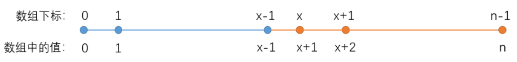
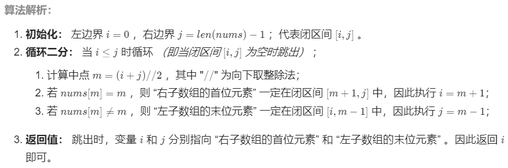

## 题目

```None
一个长度为n-1的递增排序数组中的所有数字都是唯一的，并且每个数字都在范围0～n-1之内。在范围0～n-1内的n个数字中有且只有一个数字不在该数组中，请找出这个数字。
-----------------------------------------------------------------------------
输入: [0,1,3]
输出: 2
-----------------------------------------------------------------------------
输入: [0,1,2,3,4,5,6,7,9]
输出: 8
-----------------------------------------------------------------------------
限制：1 <= 数组长度 <= 10000
```

## 思路

- 数学方法
- 二分查找

一个从0开始的递增排序数组，元素都是唯一，如果不缺失的话，下标应和元素值相同。



## 补充

（可选）

## 题解

方法1：求和 or 遍历

```python
class Solution:
    def missingNumber(self, nums: List[int]) -> int:
        return int(len(nums) * (len(nums) + 1) / 2 - sum(nums))
```

```python
class Solution:
    def missingNumber(self, nums: List[int]) -> int:
        for i in range(len(nums)):
            if nums[i] != i:
                return i
        return len(nums) # 否则缺失的是最后一个元素，这里是len(nums)-1 + 1
```

复杂度分析：

```
时间复杂度O(N): 遍历或者求和时间复杂度为O(N)
空间复杂度O(1): 使用常数大小额外空间
```

方法2：排序数组中的搜索问题，首先想到二分法解决

```
数组可以划分成两部分：
· 左子数组：nums[i] = i   · 右子数组：nums[i] ≠ i
缺失的数组等于「右子数组的首位元素」对应的索引
```



```python
class Solution:
    def missingNumber(self, nums: List[int]) -> int:
        i, j = 0, len(nums) - 1 # 错误写法: j=len(nums)
        while i <= j:
            m = (i + j) // 2
            if nums[m] == m: i = m + 1 
            if nums[m] > m: j = m -1
        return i
```

复杂度分析：

```
时间复杂度O(logN): 二分法为对数级别复杂度
空间复杂度O(1): 使用常数大小额外空间
```

